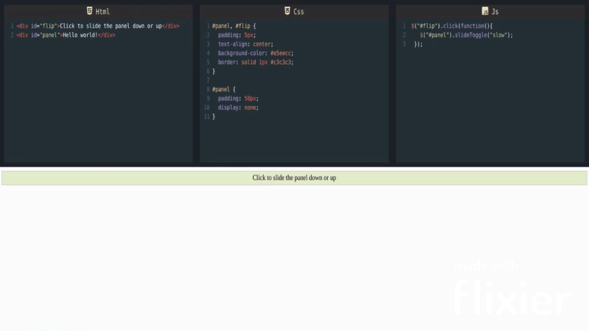

# Editor.io

## Code editor for HTML, CSS and Javascript to discover frontend code

  

### Features:

- work and build web pages.
- Auto Save of all your work
- Supports JQuery
- Autoclose of tags and brackets
- Live Preview

## Features

- GFM
- Supports Html Tags
- Custom toolbar to make editing easier
- Live Preview
- Auto save of work
- Download the file Readme.md file

### Show your support

Give a ⭐ if you like this website!

